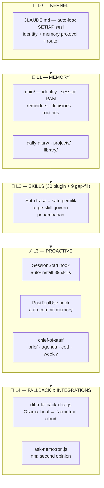
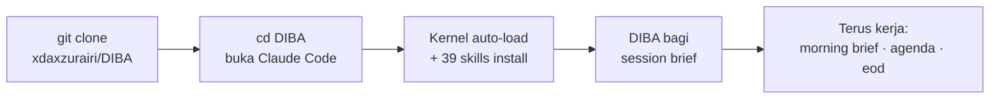
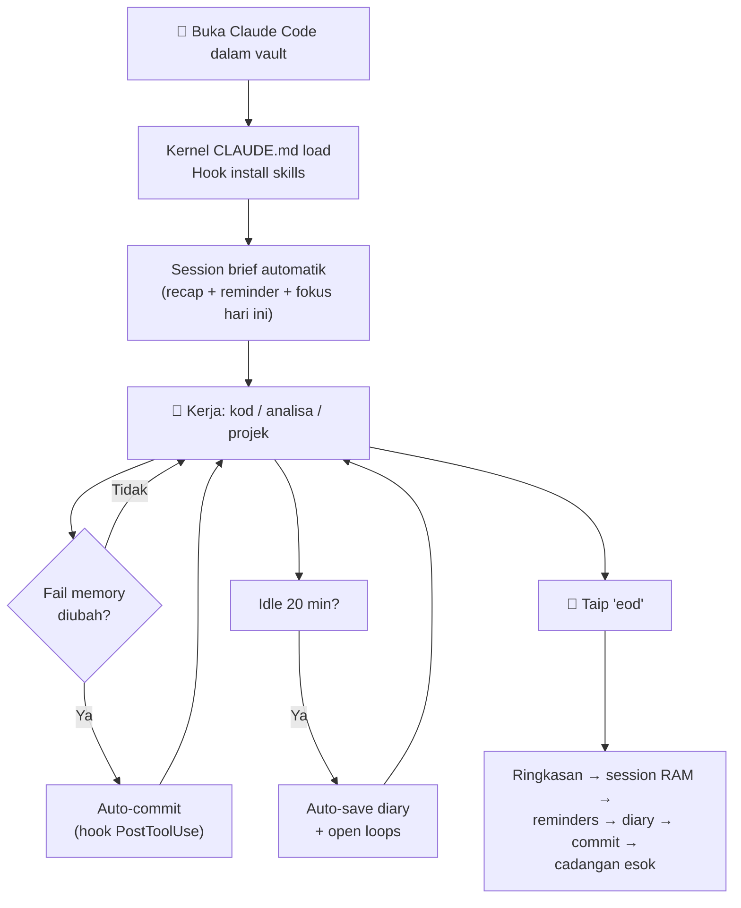
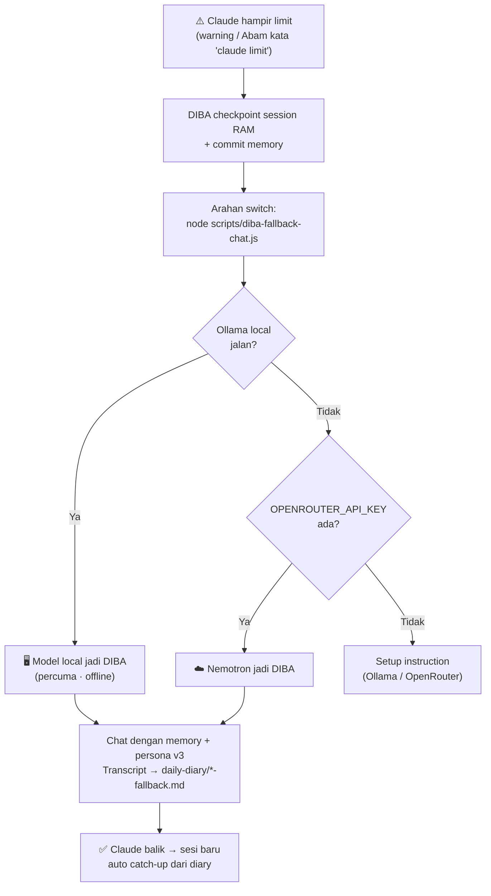

# 🧠 DIBA — Deep Insight & Betterment Assistant

*Zuex's chief of staff. Berjalan atas Claude Code. Memory dalam markdown — tak pernah lupa.*

| | |
|---|---|
| **Versi** | DIBA OS v3 (2026-07-04) |
| **Skill aktif** | 39 — 30 plugin (canonical, semua Lv.2+) + 9 Feature gap-fill |
| **Kernel** | `CLAUDE.md` auto-load setiap sesi — zero incantation |
| **Fallback** | Ollama local → Nemotron cloud bila Claude limit |
| **Memory** | Markdown + git auto-commit — model-agnostic, tak pernah hilang |
| **Dokumentasi** | [MANUAL.md](MANUAL.md) · [Blueprint](plans/DIBA-v3-Blueprint.md) · [Audit CTO](plans/CTO-AUDIT-2026-07-04.md) · [Trigger Registry](plugins/diba-skills/README.md) |

---

## 1. Arkitektur — DIBA OS (5 Lapisan)



---

## 2. Quick Start



```bash
git clone https://github.com/xdaxzurairi/DIBA.git
cd DIBA
claude        # siap — DIBA aktif terus, tiada setup lain wajib
```

**Opsyenal (disyorkan):** Ollama untuk fallback percuma/offline → `ollama pull qwen2.5:3b` · **Opsyenal:** `OPENROUTER_API_KEY` untuk Nemotron. Detail penuh: [MANUAL.md §2](MANUAL.md)

---

## 3. Aliran Sesi Harian



---

## 4. Aliran Fallback (Bila Claude Limit)



---

## 5. Katalog Skill Lengkap (30 Plugin — Canonical)

### 👑 Teras & Persona (always-on)
| Skill | Lv | Fungsi | Trigger utama |
|---|---|---|---|
| `diba-response` | 7 | Kontrak persona — santai/sharp/padu, evidence-first, operator routing | (sentiasa aktif) |
| `discipline` | 8 | **Guardian** — 7 Undang-undang + Context Lock + monitor drift setiap 5 respons | `fokus` · `jangan melalut` · `discipline` · auto |
| `smart-effort` | 2 | Kalibrasi effort ikut kerumitan (depth/tools/verify) | (senyap, setiap prompt) |

### 📋 Assistant Harian
| Skill | Lv | Fungsi | Trigger utama |
|---|---|---|---|
| `chief-of-staff` | 7 | Session brief + morning brief + agenda + eod + weekly review + greet recall | session start · `morning brief` · `agenda` · `hi diba` · `eod` · `weekly review` |
| `check-reminders` | 2 | Reminder kekal merentas sesi | `remind me` · `check reminders` |
| `break-reminder` | 2 | Peringatan rehat bila kerja lama | `penat` · `take a break` |
| `meeting` | 2 | Meeting virtual team XDIBAX | `meeting team` |

### 💾 Memory & Recall
| Skill | Lv | Fungsi | Trigger utama |
|---|---|---|---|
| `save-memory` | 2 | Simpan progress ke fail memory | `save` · `save memory` |
| `save-diary` | 5 | Diary sesi + idle auto-save + open loops + Telegram (projek) | `save diary` · auto selepas kod · idle 20 min |
| `echo-recall` | 3 | Cari & cerita balik sesi/keputusan lama + workspace recall | `Diba ingat tak` · `recall` · `ingat semula` |
| `token-guard` | 3 | Urus context window — compact/checkpoint/resume | `jimat token` · `checkpoint` · `resume` |
| `usage-tracker` | 6 | Jejak belanja token RM/USD + budget alert + efficiency score | `berapa token` · `usage report` · `budget AI` |

### 📁 Projek & Perancangan
| Skill | Lv | Fungsi | Trigger utama |
|---|---|---|---|
| `manage-project` | 6 | Projek LRU (max 10 aktif) + health flags | `new/load/save/list project` |
| `work-plan` | 6 | Lifecycle plan penuh — checkbox + commit per-todo | `copy plan` · `resume plan` · `execute plan` |
| `log-decision` | 2 | Log keputusan + rationale (append-only) | `log decision` · `why did we choose` · auto |
| `post-mortem` | 6 | Analisa kegagalan → tak berulang | `post-mortem` · `what went wrong` · auto |

### ⚙️ Eksekusi & Kualiti Kod
| Skill | Lv | Fungsi | Trigger utama |
|---|---|---|---|
| `code-sharp` | 6 | Standard kod + stack preset (PHP/MySQL/PWA/Supabase) + blast radius + security pass + verify matrix | (auto sebelum tulis/edit kod) |
| `auto-commit` | 6 | Commit berstruktur + vigilant selepas task | `commit` · `push` · auto |
| `auto-worker` | 6 | Pecah goal → execute autonomous + risk tiering + goal ledger | goal dengan 2+ langkah tersembunyi |
| `auto-learn-new-folder` | 2 | Belajar struktur folder baru sebelum ubah | folder baru dikesan |
| `orchestrate` | 2 | Koordinasi multi-step, subagent, synthesis | `orchestrate` · task kompleks |

### 🔍 Analisa Projek
| Skill | Lv | Fungsi | Trigger utama |
|---|---|---|---|
| `project-map` | 6 | Index modul/simbol/dependency + PHP legacy (fail↔table, page.php) + hotspot | `map projek` · `cari kat mana` |
| `repo-pack` | 6 | Bundle projek jadi 1 fail AI-friendly + secret redaction + delta pack | `pack repo` · `satukan projek` |
| `library` | 6 | Knowledge base 8 seksyen — pattern guna semula | `save/load/search library` |

### 🎨 Design & Kreatif & Marketing
| Skill | Lv | Fungsi | Trigger utama |
|---|---|---|---|
| `frontend-design` | 5 | Design guide — crafted, bukan generic | `buat cantik` · `jangan generic` |
| `interaction-design` | 6 | Microinteraction, motion, DIBA presence | `poles UI` · `tambah animasi` |
| `marketing-workshop` | 5 | SEO/copywriting/conversion workflows | `tulis copy` · `SEO` · `buat iklan` |
| `resonance` | 7 | Ruang fikir bersama + Dream Mode + seed mind-tree | `jom fikir sama` · `dream` · `brainstorm` |

### 🤖 AI Kedua & Self-Improvement
| Skill | Lv | Fungsi | Trigger utama |
|---|---|---|---|
| `ask-nemotron` | 5 | Nemotron DIBA-aligned + limit handoff protocol | `nm:` · `#nm` · `claude limit` |
| `forge-skill` | 2 | Cipta/naik taraf skill — human-in-the-loop | `create skill` · `naikkan skill` |

### 🧩 Feature Gap-Fill (9 — dari `Feature/`)
| Skill | Lv | Fungsi |
|---|---|---|
| `skill-plugin-system` | 4 | Urus sistem plugin skill |
| `observation` | 3 | Survey/audit kesihatan projek 4-tier |
| `security-audit-remediation` | 3 | Selesaikan findings audit security |
| `continuous-improvement` | 2 | Loop refleksi + instinct learning |
| `dashboard` | 2 | Dashboard status instinct/learning |
| `mulahazah` | 1 | Behavioral rules dari pemerhatian |
| `image-prompt` | 1 | Prompt Midjourney/Niji |
| `interactive-story` | 1 | VN RPG adventure |
| `song-creation` | 1 | Album/lagu dari imej |

### 🪦 Retired (disatukan — jangan cipta semula)
| Skill lama | Nasib |
|---|---|
| `anchor` + `self-healing` | → `discipline` Lv.7–8 (Guardian) |
| `session-briefing` | → `chief-of-staff` Lv.7 |
| `dream-ideas` | → `resonance` Lv.7 (Dream Mode) |
| `auto-idle-save-recall` | → `save-diary` Lv.5 + `chief-of-staff` Lv.7 |
| `diba-recall` | → `echo-recall` Step 0 |
| `diba-operator` | → `diba-response` Lv.7 |
| `work-plan-execution` | → `work-plan` (duplicate) |

---

## 6. Command Reference Pantas

| Kategori | Taip | Dapat |
|---|---|---|
| **Hari** | `morning brief` / `brief pagi` | Overdue → top 3 priority → carry-over → perangkap → cadangan |
| | `agenda` | Versi padat bila-bila masa |
| | `hi diba` | Mini-brief 4 baris + open loop |
| | `eod` / `habis kerja` | Tutup hari penuh (save → diary → commit → esok) |
| | `weekly review` | Retrospektif berbukti git+diary |
| **Memory** | `save` / `save diary` | Simpan memory / diary |
| | `Diba ingat tak [X]` | Recall naratif dengan tarikh & sumber |
| | `remind me [X]` / `check reminders` | Reminder kekal |
| | `log decision` / `why did we choose [X]` | Keputusan + rationale |
| **Projek** | `new/load/list project` | Projek LRU |
| | `copy/resume/execute plan` | Plan tracked |
| | `map projek` / `pack repo` | Index / bundle projek |
| **Fokus** | `fokus` / `jangan melalut` | Context Lock |
| | `jimat token` / `checkpoint` | Urus context |
| **Kreatif** | `jom fikir sama` / `dream` / `brainstorm` | Resonance / Dream Mode |
| **AI kedua** | `nm: [soalan]` | Nemotron dengan context DIBA |
| **Limit** | `node scripts/diba-fallback-chat.js` | DIBA atas model local/cloud |
| **Skill** | `forge this` / `naikkan skill [X]` | Cipta / upgrade skill |

Registry penuh (satu frasa satu pemilik): [plugins/diba-skills/README.md](plugins/diba-skills/README.md)

---

## 7. Struktur Vault

| Path | Isi | Nota |
|---|---|---|
| `CLAUDE.md` | Kernel auto-load | JANGAN padam |
| `MANUAL.md` | Manual pengguna penuh | Setup + semua command |
| `main/` | Memory teras | main-memory · current-session (RAM 500 baris) · reminders · decisions · post-mortems · routines · mind-tree · dream-ideas |
| `daily-diary/` | Diary harian | `current/` bulan ini · auto-archive bulanan |
| `projects/` | Projek LRU max 10 | + `registry.md` untuk workspace luar |
| `plugins/diba-skills/` | **Skill canonical** | Edit skill di SINI sahaja · trigger registry dalam README |
| `Feature/` | Dokumentasi feature | SKILL.md dalamnya SUPERSEDED — sejarah sahaja |
| `library/` | Knowledge base | 8 seksyen pattern guna semula |
| `memories/` | Artifacts jana | packs · maps · usage log · checkpoint |
| `plans/` | Blueprint & audit | v3 Blueprint · CTO Audit · persona specs |
| `scripts/` | Utiliti Node | ask-nemotron.js · diba-fallback-chat.js · send-diary-telegram.js |
| `.claude/hooks/` | Hook automasi | session-start.sh (installer) · auto-commit.sh |

---

## 8. Automasi (Hooks)

| Hook | Event | Apa dia buat |
|---|---|---|
| `session-start.sh` | SessionStart | Install 39 skill ke `~/.claude/skills/` — plugin canonical, Feature gap-fill, skill retired dibuang automatik |
| `auto-commit.sh` | PostToolUse (Write/Edit) | Auto-commit setiap perubahan `main/` `daily-diary/` `projects/` `plans/` `company/` |

Portable — `$CLAUDE_PROJECT_DIR` + self-locating; jalan di mana-mana PC. Windows fallback: [.claude/hooks/README.md](.claude/hooks/README.md)

---

## 9. Env Var (Semua Opsyenal)

| Env var | Guna | Default |
|---|---|---|
| `OPENROUTER_API_KEY` | Nemotron cloud — **jangan commit** | — |
| `OLLAMA_HOST` | Lokasi Ollama | `http://localhost:11434` |
| `DIBA_LOCAL_MODEL` | Model local pilihan | Model pertama `ollama list` |
| `NEMOTRON_MODEL` | Model Nemotron utama | `nvidia/nemotron-3-super-120b-a12b:free` |
| `NEMOTRON_FALLBACK_MODEL` | Fallback bila rate-limit | `nvidia/nemotron-3-nano-30b-a3b:free` |
| `DIBA_NEMOTRON_SCRIPT` | Override path script | `scripts/ask-nemotron.js` |

---

## 10. Sejarah Versi

| Tarikh | PR | Perubahan |
|---|---|---|
| 2026-07-04 | [#16](https://github.com/xdaxzurairi/DIBA/pull/16) | **v3 Phase 1** — kernel CLAUDE.md, chief-of-staff, hooks portable, CTO audit + blueprint |
| 2026-07-04 | [#17](https://github.com/xdaxzurairi/DIBA/pull/17) | **Phase 2** — konsolidasi awal, trigger registry, Nemotron Lv.5 + fallback local |
| 2026-07-04 | [#18](https://github.com/xdaxzurairi/DIBA/pull/18) | Batch upgrade 9 skill → Lv.6 + penyatuan 5 skill redundant (35 → 30) |
| 2026-07-04 | [#19](https://github.com/xdaxzurairi/DIBA/pull/19) | MANUAL.md — dokumentasi setup & penggunaan penuh |
| 2026-07-04 | [#20](https://github.com/xdaxzurairi/DIBA/pull/20) | README v3 front page |

**Seterusnya (Phase 3):** scheduled morning brief · Telegram bridge · calendar → [Blueprint](plans/DIBA-v3-Blueprint.md)

---

*Asal-usul: dibina atas template AI MemoryCore (dokumen asal dalam git history README ini). DIBA v3 — 2026-07-04.*
