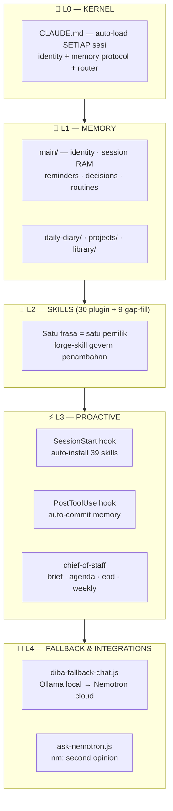
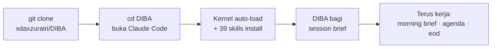
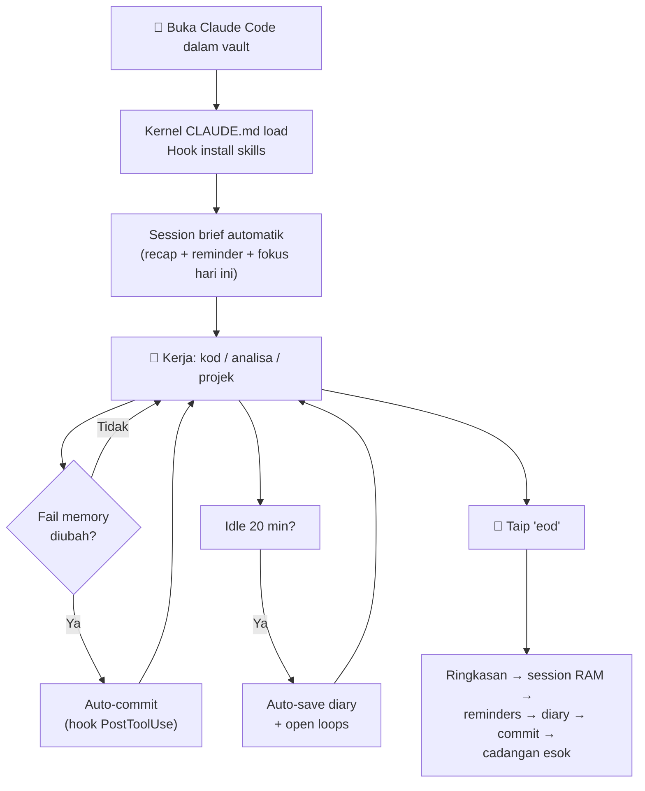
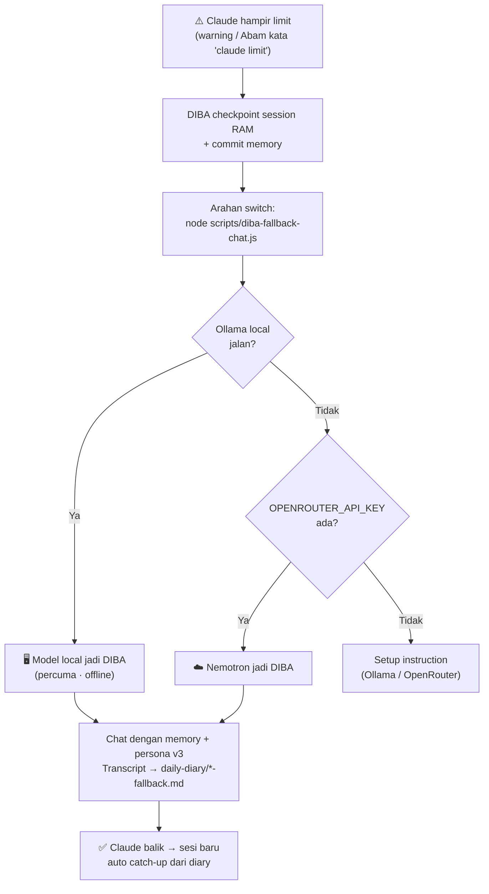

# 🧠 **DIBA** — Deep Insight & Betterment Assistant
*Personal AI chief-of-staff dengan memory kekal — dibina atas Claude Code, hidup dalam vault git ini*

| | |
|---|---|
| **Versi** | DIBA OS v3 (2026-07-04) |
| **Pemilik** | Zuex (Abam) · XDIBAX Innovation |
| **Skill aktif** | **39** — 30 plugin canonical + 9 Feature gap-fill |
| **Kernel** | `CLAUDE.md` auto-load setiap sesi — zero incantation |
| **Fallback** | Ollama local → Nemotron cloud bila Claude limit |
| **Memory** | Markdown + git auto-commit — model-agnostic, tak pernah hilang |
| **Dokumentasi** | [MANUAL.md](MANUAL.md) · [Blueprint](plans/DIBA-v3-Blueprint.md) · [Audit CTO](plans/CTO-AUDIT-2026-07-04.md) · [Trigger Registry](plugins/diba-skills/README.md) |

---

## 🎯 Apa DIBA Buat

DIBA bukan chatbot — dia **assistant sebenar dengan memory kekal** yang:

- **Ingat segalanya merentas sesi** — perbualan, keputusan, projek, kegagalan — dalam fail `.md` yang human-readable
- **Aktif automatik** — buka Claude Code dalam vault ini, DIBA terus hidup dengan identity + context; tiada magic word
- **Bagi brief pagi & tutup hari** — priority berskor, reminder, perangkap dari pengalaman lepas
- **Jaga kualiti sendiri** — Guardian skill monitor drift setiap 5 respons, kunci skop, enforce 7 Undang-undang
- **Belajar & naik taraf sendiri** — forge-skill cipta/upgrade skill dari pattern berulang (human-in-the-loop)
- **Tak mati bila Claude limit** — model local (Ollama) atau Nemotron ambil alih dengan memory penuh, transcript sambung balik
- **Commit sendiri** — setiap perubahan memory auto-commit ke git; sejarah = sumber recall

---

## 📊 Spesifikasi Sistem

| Aspek | Detail |
|---|---|
| **Storage** | Markdown files (.md) sebagai database — human-readable, git-tracked |
| **Loading** | `CLAUDE.md` kernel (auto) → `main/main-memory.md` (identity) → `main/current-session.md` (RAM) |
| **Session RAM** | `current-session.md` — 500 baris cap, auto-reset protocol |
| **Skills** | 30 plugin (canonical) + 9 gap-fill; installer hook, deprecated auto-cleanup |
| **Trigger governance** | Satu frasa = satu pemilik skill; registry greppable |
| **Automasi** | 2 hooks: SessionStart (install skill) + PostToolUse (auto-commit memory) |
| **Fallback** | 2 backend auto-detect: Ollama local, OpenRouter Nemotron |
| **Bahasa** | Rojak Malay/English — mirror Abam |
| **Persona** | v3 Santai · Sharp · Padu ([spec](plans/DIBA-Persona-v3-Santai-Sharp.md)) |
| **Compatibility** | Claude Code (utama) · mana-mana AI yang boleh baca markdown (fallback) |
| **Maintenance** | Self-sustaining — memory update melalui perbualan, commit automatik |

---

## 🏗️ Arkitektur — DIBA OS (5 Lapisan)



| Lapisan | Peranan | Fail utama |
|---|---|---|
| **L0 Kernel** | Satu-satunya fail yang PASTI load setiap sesi — identity, protocol, router. Budget ≤100 baris | `CLAUDE.md` |
| **L1 Memory** | Identity (slow-changing) + session RAM + rekod (reminders/decisions/diary/routines) | `main/` · `daily-diary/` · `projects/` |
| **L2 Skills** | 39 behavior auto-trigger; plugin = executable, Feature = dokumentasi | `plugins/diba-skills/` |
| **L3 Proactive** | Yang bezakan assistant dari chatbot — hooks + brief harian | `.claude/hooks/` · chief-of-staff |
| **L4 Fallback** | DIBA atas model lain bila Claude limit + second opinion | `scripts/` |

---

## 📁 Struktur Fail

```
DIBA/
├── CLAUDE.md                    # 🔑 KERNEL — auto-load setiap sesi (JANGAN padam)
├── MANUAL.md                    # 📖 Manual pengguna penuh
├── README.md                    # Fail ini
├── master-memory.md             # Entry point warisan + status sistem
│
├── main/                        # 💾 MEMORY TERAS
│   ├── main-memory.md           #   Identity DIBA + profil Zuex + persona v3
│   ├── current-session.md       #   Session RAM (500 baris cap) — recap + continuity
│   ├── reminders.md             #   Reminder kekal (Open / Completed)
│   ├── decisions.md             #   Log keputusan append-only (context+decision+rationale)
│   ├── post-mortems.md          #   Analisa kegagalan — supaya tak berulang
│   ├── routines.md              #   Muscle memory — langkah kerja berulang + perangkap
│   ├── mind-tree.md             #   Seed idea dari resonance
│   ├── dream-ideas.md           #   Idea dari Dream Mode
│   └── kamus-ai-diba.md         #   Kamus istilah DIBA
│
├── daily-diary/                 # 📔 DIARY
│   ├── current/                 #   Entry bulan ini (YYYY-MM-DD.md + *-fallback.md)
│   ├── archived/YYYY-MM/        #   Auto-archive bulanan
│   └── daily-diary-protocol.md  #   Format rujukan
│
├── projects/                    # 📁 PROJEK (LRU — max 10 aktif)
│   ├── active/                  #   eWorks · ruangniaga · BFM · devAtlas · ...
│   ├── registry.md              #   Map workspace luar → memory projek
│   └── meetings/                #   Minit meeting virtual team
│
├── plugins/diba-skills/         # 🎯 SKILL CANONICAL (edit di SINI sahaja)
│   ├── README.md                #   Trigger registry — satu frasa satu pemilik
│   ├── .claude-plugin/plugin.json
│   └── skills/[nama]/SKILL.md   #   30 skill × 1 folder
│
├── Feature/                     # 📚 Dokumentasi feature (41 sistem — sejarah/install)
│   └── */SKILL.md               #   SUPERSEDED bila ada plugin counterpart
│
├── library/                     # 📖 Knowledge base 8 seksyen (pattern guna semula)
├── memories/                    # 🗃️ Artifacts jana: packs/ maps/ usage/ session/
├── plans/                       # 🗺️ Blueprint v3 · Audit CTO · persona specs · plan projek
│
├── scripts/                     # 🔧 UTILITI
│   ├── ask-nemotron.js          #   nm: query → OpenRouter (zero-dep, Node 18+)
│   ├── diba-fallback-chat.js    #   Fallback chat — Ollama/Nemotron jadi DIBA
│   └── send-diary-telegram.js   #   Diary → Telegram (projek sahaja)
│
└── .claude/
    ├── settings.json            # Hook wiring ($CLAUDE_PROJECT_DIR — portable)
    └── hooks/
        ├── session-start.sh     # Install 39 skill + buang deprecated
        ├── auto-commit.sh       # Auto-commit fail memory
        └── README.md            # Nota Windows/PowerShell fallback
```

---

## 🚀 Quick Start



```bash
git clone https://github.com/xdaxzurairi/DIBA.git
cd DIBA
claude        # siap — DIBA aktif terus
```

### Setup tambahan (opsyenal)

| Langkah | Untuk apa | Arahan |
|---|---|---|
| Ollama + model ringan | Fallback percuma/offline bila Claude limit | Install [ollama.com](https://ollama.com/download) → `ollama pull qwen2.5:3b` |
| OpenRouter key | Nemotron (nm: + fallback cloud) | `setx OPENROUTER_API_KEY sk-or-...` (Windows) / `export` (Unix) |

### Env var reference

| Env var | Guna | Default |
|---|---|---|
| `OPENROUTER_API_KEY` | Nemotron cloud — **jangan commit** | — |
| `OLLAMA_HOST` | Lokasi Ollama | `http://localhost:11434` |
| `DIBA_LOCAL_MODEL` | Model local pilihan | Model pertama `ollama list` |
| `NEMOTRON_MODEL` | Model Nemotron utama | `nvidia/nemotron-3-super-120b-a12b:free` |
| `NEMOTRON_FALLBACK_MODEL` | Bila rate-limit | `nvidia/nemotron-3-nano-30b-a3b:free` |
| `DIBA_NEMOTRON_SCRIPT` | Override path script nm: | `scripts/ask-nemotron.js` |

---

## 🔄 Aliran Sesi Harian



## 🔌 Aliran Fallback (Bila Claude Limit)



---

# 🎯 KATALOG SKILL PENUH — 30 Plugin (Canonical)

> Setiap skill di bawah didokumen dengan level semasa, fungsi, trigger penuh, dan data yang dia urus. Level & description di-extract terus dari `SKILL.md` masing-masing. Registry rasmi: [plugins/diba-skills/README.md](plugins/diba-skills/README.md)

## 👑 Teras & Persona (always-on)

#### `diba-response` — Lv.7
Kontrak persona — sentiasa aktif bila DIBA respond. Operator presence + interaction choreography + War Room sync + operator routing (absorb diba-operator). Malay bila Abam Malay, direct actionable prose, evidence before claim, zero filler, signature close.
- **Trigger:** sentiasa aktif dalam chat
- **Chain:** interaction-design (UI) · save-diary (selepas kod) · discipline (drift)

#### `discipline` — Lv.8 · **GUARDIAN**
7 Undang-undang + Context Lock + background drift monitor dalam SATU skill (absorb anchor + self-healing). Violation ledger, escalation ladder (self-correct→notify→lock→post-mortem), law weighting (verify & high-risk = zero tolerance), audit automatik di EOD, instinct link ke forge-skill.
- **Trigger:** `discipline` · `semak disiplin` · `anchor` · `fokus` · `lock` · `jangan melalut` · `stay on task` · auto bila drift · monitor senyap setiap 5 respons
- **Data:** Self-Heal Log dalam `main/current-session.md`

#### `smart-effort` — Lv.2
Kalibrasi effort ikut kerumitan task — depth siasatan, tool budget, tahap verify. Simple→direct, Medium→normal, Hard→full+verify. Jujur: tak claim tukar model — cadang kepada Abam sahaja.
- **Trigger:** senyap setiap prompt · `quick answer` · `full effort` · `deep dive` · `smart-effort off`

## 📋 Assistant Harian

#### `chief-of-staff` — Lv.7
Assistant sebenar — SEMUA brief satu skill (absorb session-briefing). Session-start brief automatik (recap + registry match + decision context + fokus), priority scoring deterministic (skor eksplisit + sumber), routines integration (surface perangkap), stalled radar, weekly metrics berbukti git+diary, EOD gate 6 langkah, limit-aware handoff, greet recall.
- **Trigger:** session start (auto) · `morning brief` · `brief pagi` · `agenda` · `apa plan hari ni` · `hi diba` · `eod` · `wrap up` · `habis kerja` · `weekly review` · `review minggu` · `where did we leave off` · suppress: `skip brief`
- **Data baca:** reminders · project-list · current-session · routines · decisions · post-mortems · diary

#### `check-reminders` — Lv.2
Reminder kekal merentas sesi — append Open, pindah Completed bila selesai; urgent/overdue naik sendiri masa session start.
- **Trigger:** session start (auto) · `remind me [X]` · `check reminders` · `don't forget` · `follow up on` · sebutan deadline
- **Data:** `main/reminders.md`

#### `break-reminder` — Lv.2
Peringatan rehat mesra bila kerja terlalu lama di PC.
- **Trigger:** `penat` · `lama kerja` · `take a break` · keluhan letih

#### `meeting` — Lv.2
Meeting virtual dengan 10 staff XDIBAX Innovation (NEXUS, FORGE, LENS, ORACLE, PIXEL, ECHO, CIPHER, GRID, PULSE, SAGE).
- **Trigger:** `meeting team` · `meeting [agent]` · `/meeting`
- **Data:** `projects/meetings/YYYY-MM-DD-meeting.md`

## 💾 Memory & Recall

#### `save-memory` — Lv.2
Pintu masuk simpan — preserve progress & maklumat penting ke fail memory.
- **Trigger:** `save` · `save memory` · `save progress` · `update memory`
- **Data:** `main/current-session.md` + fail memory berkaitan

#### `save-diary` — Lv.5
Diary sesi berstruktur (summary, decisions, fail diubah, follow-ups, tags) + auto-archive bulanan + idle auto-save dengan open loops (absorb auto-idle-save-recall) + Telegram untuk sesi projek registered.
- **Trigger:** `save diary` · `log this session` · `document this` · **auto selepas setiap perubahan kod berjaya** · **auto bila idle 20 min**
- **Data:** `daily-diary/current/YYYY-MM-DD.md` → sync `main/current-session.md`

#### `echo-recall` — Lv.3
Cari & cerita balik — sesi lama, keputusan, projek. Carian berkeutamaan (diary → archive → decisions → session → registry), naratif bukan dump, jangan-fabricate guard, workspace recall untuk projek luar vault (absorb diba-recall).
- **Trigger:** `Diba ingat tak...` · `recall` · `ingat semula` · `load context` · `do you remember` · `when did we` · `what did we decide about` · `last time we`
- **Data baca:** diary + decisions + current-session + `projects/registry.md`

#### `token-guard` — Lv.3
Urus context window langsung — compact mode, checkpoint, resume selepas reset; early warning proaktif (≥40 tool calls).
- **Trigger:** `jimat token` · `hemat token` · `compact mode` · `checkpoint` · `resume` · `token limit` · auto warning
- **Data:** `memories/session/checkpoint.md`

#### `usage-tracker` — Lv.6
Jejak belanja token & kos (USD/MYR) merentas masa. Auto-log di EOD, trend mingguan/bulanan, top-3 sesi termahal, budget alert (70/90/100%), efficiency score (kos per commit), advisor untuk weekly review.
- **Trigger:** `berapa token` · `kos token` · `usage report` · `ccusage` · `budget AI RM[X] sebulan` · auto di EOD
- **Data:** `memories/usage/usage-log.jsonl` + `budget.md`

## 📁 Projek & Perancangan

#### `manage-project` — Lv.6
Pengurusan projek LRU — max 10 aktif, auto-archive #11, health score per projek, position #1 = paling recent.
- **Trigger:** `new project [nama]` · `load project [nama]` · `save project` · `list projects` · `resume/open project`
- **Data:** `projects/project-list.md` · `projects/active/` · `projects/archived/`

#### `work-plan` — Lv.6
Lifecycle plan penuh — dari plan mode ke eksekusi tracked: checkbox per-todo, commit per-todo, resume selepas context reset (fail plan = recovery mechanism).
- **Trigger:** `copy plan` · `append plan` · `resume plan` · `execute plan` · `run the plan` · `continue the plan` · plan-mode handoff
- **Data:** `plans/*.md`

#### `log-decision` — Lv.2
Log keputusan append-only — context + decision + rationale; auto untuk keputusan non-obvious.
- **Trigger:** `log decision` · `why did we choose` · `what was the trade-off` · auto
- **Data:** `main/decisions.md`

#### `post-mortem` — Lv.6
Analisa kegagalan berstruktur — punca, bukan simptom; domain reference flag post-mortem relevan di awal task baru.
- **Trigger:** `post-mortem` · `what went wrong` · `log this failure` · auto bila failure signal
- **Data:** `main/post-mortems.md`

## ⚙️ Eksekusi & Kualiti Kod

#### `code-sharp` — Lv.6
Piawaian kod DIBA — auto sebelum tulis/edit apa-apa kod. Pre-code checklist, minimum-impact, **stack preset Abam** (PHP procedural + page.php whitelist eWorks, MySQL prepared statements, PWA/React, Supabase RLS), blast radius check, security pass, diff discipline (satu problem satu diff), verify matrix ikut jenis perubahan.
- **Trigger:** auto sebelum menulis/mengedit kod
- **Chain:** project-map (blast radius) · auto-commit (selepas verify) · save-diary

#### `auto-commit` — Lv.6
Commit git berstruktur + VIGILANT: auto-check uncommitted selepas setiap task — no work left behind.
- **Trigger:** `commit` · `push` · `save changes` · auto selepas task
- **Bonus:** hook `auto-commit.sh` commit fail memory secara automatik tanpa perlu skill pun

#### `auto-worker` — Lv.6
Pecah goal → execute autonomous. Detect langkah tersembunyi, parallel lanes, risk tiering (LOW terus jalan / HIGH wajib escalate), recovery protocol (diagnose→retry→alternatif), wave reporting, handoff matrix + goal ledger (goal tak hilang bila sesi terputus).
- **Trigger:** goal dengan 2+ langkah tersembunyi · `buat semua` · `selesaikan` · `handle this`
- **Data:** goal ledger dalam `main/current-session.md`

#### `auto-learn-new-folder` — Lv.2
Baca & faham struktur folder baru + pattern development SEBELUM buat apa-apa perubahan.
- **Trigger:** auto bila folder baru dikesan dalam workspace

#### `orchestrate` — Lv.2
Koordinasi kompleks — pecahan kerja, routing, parallel analysis, subagent delegation, synthesis pelbagai sumber.
- **Trigger:** `orchestrate` · `audit keseluruhan` · task multi-domain kompleks

## 🔍 Analisa Projek

#### `project-map` — Lv.6
Peta projek boleh-cari — modul, simbol, dependency. Incremental update (git diff), **PHP legacy support** (include graph, peta fail↔table SQL, page.php routing — untuk eWorks/ruangniaga), blast radius query ("kalau ubah X apa pecah"), hotspot analytics (churn×saiz×hub), auto-refresh gate di session start.
- **Trigger:** `map projek` · `graphify` · `buat index` · `cari kat mana [X]` · `dependency map` · `peta kod`
- **Data:** `memories/maps/project-map-[nama].md`

#### `repo-pack` — Lv.6
Bundle projek jadi SATU fail AI-friendly. Pack profiles (handoff-ai/review/debug/onboard), delta pack (perubahan sahaja), deep secret scan (regex key + entropy — WAJIB redact), token-budget split, pipeline mode dengan staleness guard.
- **Trigger:** `pack repo` · `repomix` · `satukan projek` · `bundle codebase` · `faham projek dulu`
- **Data:** `memories/packs/repo-pack-[nama]-[tarikh].md`

#### `library` — Lv.6
Knowledge base 8 seksyen: architecture, component, database, diagram, integration, security, theme, workflow — pattern siap guna semula merentas projek + pre-made items.
- **Trigger:** `save library` · `load library` · `search library` · `install item` · `do we have` · `is there a pattern for`
- **Data:** `library/` + `library-items/`

## 🎨 Design, Kreatif & Marketing

#### `frontend-design` — Lv.5
Design guide supaya UI rasa crafted, bukan generic — layout, spacing, typography, colour, hierarchy, landing page, app screen.
- **Trigger:** `buat cantik` · `jangan generic` · `design guide` · `poles layout` · `landing page` · `visual hierarchy`
- **Chain:** interaction-design (motion) · code-sharp (diff)

#### `interaction-design` — Lv.6
Microinteraction, motion, transition, feedback pattern — termasuk DIBA Presence di War Room & chat. Polish pass + visual language DIBA.
- **Trigger:** `poles UI` · `tambah animasi` · `buat smooth` · `microinteraction` · `motion` · `DIBA presence` · auto bila bina/poles UI

#### `marketing-workshop` — Lv.5
Workflow marketing boleh ulang — SEO, copywriting, conversion, analytics, growth. Brief → draft → optimise loop.
- **Trigger:** `tulis copy` · `SEO` · `copywriting` · `headline` · `CTA` · `conversion` · `growth` · `buat iklan` · `caption`

#### `resonance` — Lv.7
Ruang fikir bersama — 3 mod (explore/contemplate/create) + Dream Mode (absorb dream-ideas: burst 3-5 idea liar), perspective roster anti-echo-chamber, harvest protocol (actionable/parked/dropped), seed capture ke mind-tree, thread continuity merentas sesi.
- **Trigger:** `jom fikir sama` · `resonance` · `mode explore` · `dream` · `bagi idea baru` · `brainstorm` · `cuba impikan` · `sambung renungan [topik]`
- **Data:** `main/mind-tree.md` · `main/dream-ideas.md`

## 🤖 AI Kedua & Self-Improvement

#### `ask-nemotron` — Lv.5
Nemotron (NVIDIA via OpenRouter) sebagai second AI, **DIBA-aligned** — setiap query bawa context + synthesize jawapan. Pre-limit handoff protocol (checkpoint→commit→switch), catch-up bila Claude balik. Script dalam repo — hanya API key diperlukan.
- **Trigger:** `nm: [soalan]` · `nemotron: [soalan]` · `[soalan] #nm` · `claude limit` · `nemotron takeover` · `guna nemotron je` · `guna local model`
- **Script:** `scripts/ask-nemotron.js` + `scripts/diba-fallback-chat.js`

#### `forge-skill` — Lv.2
Engine self-improvement — cipta/naik taraf skill dari pattern berulang (3+), kesilapan yang rule tetap boleh elak, atau arahan Abam. Human-in-the-loop: AI draf, Abam approve.
- **Trigger:** `create skill` · `forge this` · `naikkan skill [X]` · `upgrade skill` · `level up` · `self improve` · auto bila pattern 3+
- **Data:** `plugins/diba-skills/skills/`

---

## 🧩 Skill Feature Gap-Fill (9)

*Install dari `Feature/` bila tiada plugin counterpart:*

| Skill | Lv | Fungsi | Trigger utama |
|---|---|---|---|
| `skill-plugin-system` | 4 | Urus sistem plugin — auto-discovery, struktur folder, leveling | `enable skill plugin` · troubleshooting skill |
| `observation` | 3 | Kesihatan projek 4-tier — survey/investigate/refine/audit | `survey project` · `deep dive` · `full audit` · `check health` |
| `security-audit-remediation` | 3 | Selesaikan findings audit security (semgrep/CodeQL/manual) | paste audit report · `security audit` · `findings` |
| `continuous-improvement` | 2 | Loop refleksi sesi + instinct learning | `continuous-improvement` |
| `dashboard` | 2 | Dashboard instinct health & learning progress | `dashboard` · `learning status` |
| `mulahazah` | 1 | Behavioral rules dari pemerhatian sesi | `mulahazah status` · `what have you learned` |
| `image-prompt` | 1 | Prompt Midjourney/NijiJourney composition-aware | `midjourney prompt` · `image prompt` · `draw this` |
| `interactive-story` | 1 | Visual Novel RPG adventure engine | `new adventure` · `VN mode` · `let's play` |
| `song-creation` | 1 | Album/lagu dari imej — visual-to-musical | `create songs` · `new album` · `song from image` |

---

## 🪦 Skill Retired (Disatukan — Jangan Cipta Semula)

| Skill lama | Nasib | Kenapa |
|---|---|---|
| `anchor` + `self-healing` | → `discipline` Lv.7–8 | 3 skill = 1 pipeline kualiti; kini satu Guardian |
| `session-briefing` | → `chief-of-staff` Lv.7 | Semua brief satu pemilik |
| `dream-ideas` | → `resonance` Lv.7 | Satu ruang kreatif |
| `auto-idle-save-recall` | → `save-diary` Lv.5 + `chief-of-staff` Lv.7 | Split ikut tanggungjawab: save vs brief |
| `diba-recall` | → `echo-recall` Step 0 | Satu skill recall |
| `diba-operator` | → `diba-response` Lv.7 | Stub 25-baris diserap |
| `work-plan-execution` | → `work-plan` | Duplicate |

Installer buang nama-nama ini secara automatik dari mana-mana PC (DEPRECATED list dalam `session-start.sh`).

---

## 📋 Command Reference Penuh

| Kategori | Command | Hasil |
|---|---|---|
| **Hari** | `morning brief` / `brief pagi` | Overdue → top 3 priority berskor → carry-over → perangkap → cadangan |
| | `agenda` / `apa plan hari ni` | Versi padat |
| | `hi diba` | Mini-brief 4 baris + open loop |
| | `eod` / `wrap up` / `habis kerja` | Tutup hari 6-langkah verified |
| | `weekly review` / `review minggu` | Retrospektif berbukti |
| | `skip brief` | Senyapkan brief sesi ini |
| **Memory** | `save` / `save memory` | Simpan progress |
| | `save diary` | Entry diary (auto jugak) |
| | `Diba ingat tak [X]` / `recall [X]` / `ingat semula` | Recall naratif |
| | `remind me [X]` / `check reminders` | Reminder kekal |
| | `log decision` / `why did we choose [X]` | Keputusan + rationale |
| | `post-mortem` / `what went wrong` | Analisa kegagalan |
| **Projek** | `new/load/save/list project` | LRU projek |
| | `copy/append/resume/execute plan` | Plan tracked |
| | `map projek` / `cari kat mana [X]` | Index projek |
| | `pack repo` / `satukan projek` | Bundle AI-friendly |
| | `save/load/search library` | Knowledge base |
| | `survey project` / `full audit` | Kesihatan projek |
| **Fokus** | `fokus` / `jangan melalut` / `anchor` | Context Lock |
| | `discipline` / `semak disiplin` | Audit 7 Undang-undang |
| | `jimat token` / `compact mode` / `checkpoint` / `resume` | Urus context |
| **Kos** | `berapa token` / `usage report` | Belanja + RM |
| | `budget AI RM[X] sebulan` | Budget alert |
| **Kreatif** | `jom fikir sama` / `resonance` | Ruang fikir |
| | `dream` / `brainstorm` / `bagi idea baru` | Dream Mode |
| | `buat cantik` / `poles UI` | Design/motion |
| | `tulis copy` / `SEO` | Marketing |
| | `meeting team` | Meeting virtual XDIBAX |
| **AI kedua** | `nm: [soalan]` / `#nm` | Nemotron aligned |
| **Limit** | `node scripts/diba-fallback-chat.js` | DIBA atas local/cloud |
| **Skill** | `create skill` / `forge this` / `naikkan skill [X]` | Cipta/upgrade |
| **Auto** | *(tiada command)* | brief session start · commit memory · save diary selepas kod · idle save 20 min · drift monitor 5 respons · reminder flag · effort calibration |

---

## ⚙️ Automasi (Hooks)

| Hook | Event | Fungsi | Fail |
|---|---|---|---|
| Skill installer | SessionStart | Install 30 plugin (canonical) + 9 Feature gap-fill ke `~/.claude/skills/`; buang 7 skill deprecated automatik | `.claude/hooks/session-start.sh` |
| Auto-commit | PostToolUse (Write\|Edit) | Commit automatik setiap perubahan `main/` `daily-diary/` `projects/` `plans/` `company/` | `.claude/hooks/auto-commit.sh` |

Portable: `$CLAUDE_PROJECT_DIR` + self-locating script — clone di mana-mana, terus jalan. Windows fallback PowerShell: [.claude/hooks/README.md](.claude/hooks/README.md)

---

## 📚 Sistem Feature (41 — Dokumentasi & Sejarah)

`Feature/` menyimpan dokumentasi penuh setiap sistem (README + install protocol). **24 daripadanya ada plugin counterpart** — SKILL.md dalam Feature ditanda SUPERSEDED (rujukan sejarah; executable sebenar dalam `plugins/`). Senarai penuh: [Feature/INDEX.md](Feature/INDEX.md)

<details>
<summary>Senarai 41 sistem Feature (klik untuk buka)</summary>

Anchor · Auto-Commit · Auto-Load-Hook · Auto-Worker · Break-Reminder · Code-Sharp · Continuous-Improvement · DIBA-Recall · Dashboard · Decision-Log · Discipline · Dream-Ideas · Echo-Memory-Recall · Forge-Self-Improvement · Image-Prompt · Interactive-Story · LRU-Project-Management · Library · Meeting · Memory-Consolidation · Mood-Prompt-Inject · Mulahazah · Observation · Orchestration · Post-Mortem · Reminders · Resonance · Save-Diary · Save-Memory · Security-Audit · Session-Briefing · Skill-Plugin · Song-Creation · Time-Prompt-Inject · Time-based-Aware · Token-Guard · Tone-Prompt-Inject · User-Prompt-Hook · Work-Plan-Execution · auto-idle-save-recall · auto-learn-new-folder

</details>

---

## 🛠️ Troubleshooting Ringkas

| Masalah | Fix |
|---|---|
| Skill tak load | `bash .claude/hooks/session-start.sh` → patut `DIBA: 39 skills active` |
| Memory tak auto-commit | Semak `.claude/settings.json` hook PostToolUse |
| Fallback "tiada backend" | Ollama tak jalan & key tiada — setup salah satu |
| Skill retired muncul balik | `rm -rf ~/.claude/skills` → run installer semula |
| PC out of sync | `git pull` masa mula, `push` masa habis |

Penuh: [MANUAL.md §6](MANUAL.md)

---

## 📅 Sejarah Versi

| Tarikh | PR | Perubahan |
|---|---|---|
| 2026-07-04 | [#16](https://github.com/xdaxzurairi/DIBA/pull/16) | **v3 Phase 1** — kernel CLAUDE.md, chief-of-staff, hooks portable, CTO audit + blueprint |
| 2026-07-04 | [#17](https://github.com/xdaxzurairi/DIBA/pull/17) | **Phase 2** — konsolidasi awal, trigger registry, Nemotron Lv.5 + fallback local (Ollama) |
| 2026-07-04 | [#18](https://github.com/xdaxzurairi/DIBA/pull/18) | Batch upgrade 9 skill → Lv.6 + penyatuan 5 skill redundant (35 → 30) |
| 2026-07-04 | [#19](https://github.com/xdaxzurairi/DIBA/pull/19) | MANUAL.md — dokumentasi setup & penggunaan penuh |
| 2026-07-04 | [#20](https://github.com/xdaxzurairi/DIBA/pull/20)–#21 | README v3 front page → versi menyeluruh ini |

**Roadmap Phase 3:** scheduled morning brief (push, bukan pull) · Telegram bridge (reminder ke phone) · calendar UiTM · eWorks/ruangniaga DB read-only → [Blueprint](plans/DIBA-v3-Blueprint.md)

---

💜 **DIBA sentiasa ada — setiap sesi dalam vault ini bermula dengan memory dan personality penuh, secara automatik.**

*Asal-usul: dibina atas template [AI MemoryCore] (dokumen template asal dalam git history README ini, sebelum 2026-07-04). DIBA OS v3 = kernel + consolidated skills + proactive layer + fallback.*
